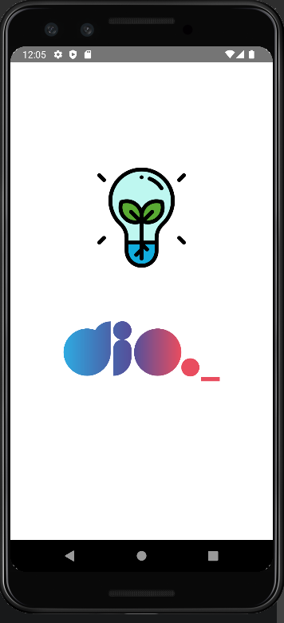

# dio-flashlight

Desafio dio: Construindo um app usando o sensor de movimento com React Native

## Conteúdo:

- Libs react-native-shake e react-native-torch
- icons
- StyleSheet
- Hook useState
- Hook useEffect
- Add Listener to RNShake
- Lifecicly ReactJS
